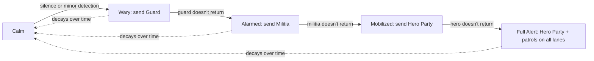

# Breach — Reverse Tower Defense: Design Spec

2026-09-19 · @Someone

A reverse tower-defense game: the player is the aggressor, building hordes to break a defended core while the defense builds, upgrades, and reacts. Six rounds of a browser prototype (HTML/JS) validated the core loop; this spec consolidates that plus the next layer of systems for a full build in Godot.

## What's already validated

Six iterations of a single-file HTML/JS prototype proved out the core loop without needing an engine. Carry these mechanics forward as-is; they've been played and tuned:

- **Round-based planning, not real-time clicking.** Player reinforces lanes, then advances a round; all combat resolves at once. Keep this for v1 even if presentation later adds animation on top (see Presentation section).
- **Lanes as tracks, not an open grid.** Early open-grid capture read as "dots and boxes"; fixed lanes with nodes read as a real front line.
- **Reinforcements travel.** Units spawn at home and march up over rounds rather than appearing at the front, so a hero party can catch a straggling group before it merges with the main force.
- **Multi-round construction.** Defender forts take rounds to build/upgrade, and are fragile while under construction — rushing an unfinished fort is a real option.
- **Capture is a choice, not an auto-resolve.** Destroying a fort lets the player Fortify (forward defense, costs Wood/Stone) or Dismantle (salvage, free). Breaking a resource garrison lets the player Harvest (steady rate) or Ravage (lump sum, node exhausted after).
- **Ground must be held.** Anything captured but left undefended (no fortification, no harvester escort) reverts to the defender if an enemy hero party walks through it unopposed. This is the current "defender regains resources" mechanic; the suspicion system below generalizes it further.
- **Alarm/messenger.** Grinding on a fort or garrison risks a messenger fleeing to raise the alarm (rising % chance per round of contact); Scout units reveal the otherwise-hidden risk; Infiltrator units bypass structures entirely and can intercept a messenger if positioned ahead of it. This is the seed of the suspicion system in the next section — it should be generalized rather than replaced.

Open gaps the prototype does not cover, carried into the sections below: only one fixed hero-party archetype, no player-built towers, no meta-progression between maps, and combat resolves invisibly rather than animating.

## Enemy threat model: suspicion, not a timer

Replace the fixed hero-party interval entirely with a single **Core Suspicion** meter (0–100) that generalizes the alarm/messenger system already built. Two independent inputs raise it:

- **Silence.** Each settlement/node normally reports resources back to the core on a schedule. No report for N rounds (tunable per node) adds suspicion — this is what happens when the player harvests, dismantles, or otherwise disrupts a node without covering it.
- **Detection.** A messenger that reaches the core, or a player unit spotted tampering with a structure, adds a larger, immediate spike.

Suspicion decays slowly when nothing is wrong. Thresholds gate an escalating response — each tier's response, if it doesn't return or report back within its own window, adds suspicion again and triggers the next tier:



Design notes:

- Each tier's unit is a real, defeatable entity, not a countdown — stopping a Guard before it reports resets that lane's suspicion growth, same as intercepting a messenger today.
- Full Alert should scale response *per lane* by how much pressure the player is applying there, not uniformly — the lane where the player is heaviest gets patrols and reinforced garrisons; quiet lanes stay calmer.
- This directly answers the "can't just sit on income" requirement: even zero combat activity eventually raises suspicion through silence, so turtling on captured resources without holding them isn't free.
- Scout and Infiltrator keep their current jobs under this model — Scout reveals the suspicion number, Infiltrator can intercept any tier's response unit, not just messengers.

## Core roster and Task Force dispatch

Generalize builders, repair crews, and every suspicion-tier response unit (Guard/Militia/Hero) into one system: the core has a finite **roster** of units by type, and any dispatch — build, repair, or respond — pulls a **Task Force** out of that roster rather than conjuring a unit from an abstract currency.

- **Roster, not just gold.** The core tracks a count per unit type (e.g. 3 Builders, 6 Guards, 2 Heroes available). Spending supplies still gates *training* new roster members over time; dispatch is then gated by *availability*, not just affordability. A core that has sent all its Builders out has none to send, even if it can afford more — until one returns or a new one finishes training.
- **One dispatch model, several purposes.** A Task Force is `{composition, purpose, destination}`: `{1 Builder → construct, empty slot X}`, `{1 Builder → repair, damaged fort Y}`, `{2 Guards → investigate, silent settlement Z}`, `{1 Hero → respond, alarm on lane W}` all use the same travel/arrival/return logic already built for hero parties in the prototype.
- **Visible and interceptable.** Every Task Force travels as a real, visible entity on its lane (like the current hero party token), so Infiltrator/ambush counterplay applies uniformly — stopping a Builder before it reaches an empty slot prevents that tower from ever going up, exactly as intercepting a messenger prevents an alarm.
- **Return to roster.** A Task Force that completes its task (finishes building, finishes repairing) returns to the roster and becomes available again, rather than being consumed — consumption only happens if the Task Force is destroyed en route or at its destination.

This turns "the defender builds a tower" from a currency-gated timer (current prototype) into a logistics problem with its own attack surface: a player who keeps killing Builders on the road starves the defender's ability to fill empty slots at all, independent of how much gold/supplies it has stockpiled.

## Economy: five resources, with decay

Keep the five-resource split validated in the prototype, and add depletion so holding a node isn't a permanent, static gain:

| Resource | Source | Spent on |
| --- | --- | --- |
| Food | Small baseline trickle + Food nodes | Raising units |
| Wood | Timber nodes, dismantling forts | Basic units, structures |
| Stone | Dismantling forts | Basic structures |
| Metal | Ore nodes | Fort/tower upgrades |
| Crystal | Ravaging any node (rare, one-time) | Unit upgrades |

New rule: a **Harvester's** yield tapers over time (e.g. –10% every N rounds) rather than staying flat forever, floors at some minimum trickle. This does two things: it stops "set up three harvesters and coast" from being the dominant strategy, and it makes Ravage (lump sum, node destroyed) a genuinely competitive choice late in a node's life rather than only an early rush option.

Open question: does a depleted Harvester become ravageable for a smaller final lump, or just fall to its floor rate permanently? Recommend the latter for simplicity in v1.

## Player meta-layer: the Lair

Before sending the next wave, the camera pulls back to the Lair — a persistent, cross-map screen where units are bred/fused and the tech tree lives. This is the meta-progression the current prototype has none of.

**Fusion, not a flat roster.** Base unit: Grem (cheap, Food only). Combinations produce new units:

```mermaid
flowchart TD
  Grem -->|2 Grem + Wood| Brute
  Grem -->|1 Grem + Food, Lair upgrade unlocked| Scout
  Grem -->|1 Grem + Food + Wood, Lair upgrade unlocked| Infiltrator
  Brute -->|2 Brute + Metal, tech unlocked| Warbeast
  Scout +.-> Infiltrator
```

- A recipe needs both the input units (consumed) and a resource cost — mirrors "2 Grem + Y Food = Brute" as specified.
- Some recipes are gated behind a Lair upgrade (a one-time unlock, paid for with resources brought back from maps) rather than being available from turn one — this is the tech tree.
- Resources carried back from a completed map convert into Lair currency at some exchange rate (needs tuning) rather than being spent directly, so map performance feeds the meta-layer without letting a single great map trivialize it.

**Open question:** does fusion happen only in the Lair between maps, or can it happen mid-map at a captured Fort (turning "fortify" into "fortify + garrison a fused unit there")? Recommend Lair-only for v1 — mid-map fusion is a natural v2 add once the base loop is proven.

## Structures and combat: the scope-defining decision

Two genuinely different games are on the table here, and this needs a deliberate choice before Godot work starts:

1. **Abstracted capture (current prototype).** Forts/settlements are single nodes on a lane with hp and a garrison. Breaking one is one combat resolution, not a siege. Player towers don't exist — the player's "defense" is Fortify/Harvester placement on captured ground.
2. **Spatial tower defense (the new ask).** Settlements/forts are physical obstacles that bar a path; the player routes units around or through them, needs dedicated siege/anti-structure units to bring one down, and can place their own towers on ground they hold, mirroring a standard TD's tower-placement grid.

Option 2 is the more classic and probably more satisfying tower-defense feel, but it's a materially bigger build: it needs real pathfinding around obstacles, a siege-unit role that doesn't exist yet, a tower-placement UI on captured ground, and rebalancing most of the numbers in this doc. Recommend committing to Option 2 as the target for the Godot build (it's clearly where the design is heading), but implementing it in two passes: ship lane-based structures first (fast, reuses everything validated in the prototype) and layer in free-form placement once the core loop is confirmed fun in 3D/2D space.

**Anti-structure requirement:** if towers can bar a path outright, at least one unit type must exist purely to bring them down (a Sapper/Siege unit — high damage to structures, weak against units), so the player always has an answer to "the road is walled off."

Every map also predefines its full set of structure slots — tower foundations and other ancillary sites — up front. A scenario decides per slot whether it starts occupied (an existing fort/settlement) or empty; empty slots aren't necessarily permanent gaps, since the core can dispatch Builders to construct on them later (see Core roster and Task Force dispatch, below). This is the same `slot` node type already in the prototype, just formalized as map-authoring data rather than always-empty-until-AI-fills-it.

## Map structure and campaign progression

Build 2–3 hand-authored maps before any map-creator tooling — prove the campaign feel first, generalize into a tool second.

**Worked early map (from your example):** one track, one loosely-defended farm, one lightly-defended fort.

| Beat | What happens | Teaches |
| --- | --- | --- |
| 1 | Player overruns the farm (weak/no garrison) | Basic movement, Food income |
| 2 | Player attacks the loosely-defended fort | Combat resolution, fort destroyed → Fortify/Dismantle choice |
| 3 | The fort's attack sends a messenger | First taste of the suspicion system |
| 4 | Warning: hero party incoming | Player must react, not just advance |
| 5 | Player ravages the farmland for a burst of Food | Ravage vs Harvest becomes a real tradeoff under pressure |

This is a clean template for a map-design pattern: **each map should teach exactly one new pressure by forcing a choice under a timer**, not introduce new mechanics passively. Later maps compose already-taught pressures (multiple suspicion sources, tighter timers, harder garrisons) rather than only adding new unit/structure types.

**Map-creator tool**, once justified by 5+ hand-built maps: needs at minimum a lane/node graph editor, garrison/resource placement, and a way to author scripted beats (like the messenger warning above) without code.

## Presentation: keep round-resolution, add animation on top

Keep the underlying simulation round-based (it's simulation-friendly, deterministic, and already balanced) but stop resolving it invisibly. When a round advances:

- Animate units marching, clashing, and structures taking damage over a few seconds rather than snapping to the new state.
- Surface structure hp, and enemy unit composition **only where scouted** — this is Scout's second job beyond alarm-risk: without one, show a fort as "a fort" with an hp bar only; with one, show its actual level/garrison type.
- Stealth units (Infiltrator and future espionage units) should be invisible to the animation/combat log entirely unless detected — no death animation, no log line — and should return to an idle state at the Lair once their task (intercept, sabotage) completes, rather than being consumed. Hero parties gaining "see invisibility" on harder difficulties is a clean way to make later maps meaningfully harder without new mechanics.

This is presentation layered on the existing math, not a rewrite of the round resolution — the Godot build can start with instant resolution (matching the prototype) and add animation as a second pass once the simulation itself is confirmed correct.

## Open design questions

- [ ] Abstracted lane combat vs full spatial tower placement (Structures section) — the single biggest scope decision.
- [ ] One overlord/playstyle for v1, or design the unit data now for multiple armies later? Recommend one now, data-driven for later.
- [ ] Does a depleted Harvester become ravageable for a reduced lump, or just floor at a low trickle permanently?
- [ ] Does fusion happen only in the Lair, or also mid-map at a fortified position?
- [ ] Exchange rate for map resources → Lair currency — needs actual numbers once Lair economy is drafted.
- [ ] Research/goals per map (mentioned but not yet specced): is this a fixed unlock tree per map, or player-chosen objectives within a map?
- [ ] Suspicion decay rate and per-tier response-unit stats — needs a tuning pass once the state machine is implemented.
- [ ] Does the map-creator tool get scoped at all for v1, or purely a post-launch investment (recommended)?
- [ ] Roster sizes and training rates per unit type (Builder/Guard/Militia/Hero) — needs tuning once the Task Force system is implemented.

## Notes for the implementing agent (Godot)

- **Data-driven units and recipes.** Units, fusion recipes, fort/tower stats, and map layouts should all be Resource (`.tres`) definitions, not hardcoded scenes — this is what makes "one overlord now, more later" and "map-creator eventually" affordable.
- **Separate simulation from presentation.** A pure-logic autoload (round resolution, suspicion, economy) that emits events; a separate scene tree consumes those events to animate. This mirrors the prototype's `advanceRound()` function directly and keeps the simulation testable headlessly.
- **State machine for enemy AI**, matching the suspicion escalation diagram above — each tier is a state with its own entry action (spawn response unit) and transition conditions (unit returns / doesn't / times out).
- **Fog-of-war as a data flag, not a rendering trick.** Each structure/unit has a `revealed: bool` (or `revealed_until: round`) that Scout presence sets; rendering just checks the flag. Keeps stealth and hero "see invisibility" trivial to add later as another reveal condition.
- **Port the prototype's balance numbers as starting defaults** (unit costs, fort hp/dmg, alarm increment, hero stats) rather than re-deriving them — they've already had six rounds of tuning.
- Treat the live HTML prototype as the reference implementation for exact current behavior when anything in this doc is ambiguous — it's the ground truth for what's been validated.

## Decisions

Scope and mechanics decided for the first vertical slice (`specs/00-scope-and-map.md`
and its sibling specs implement these). Recorded here per
`AI_First_Development_Kit/principles/decision-ledger.md` — append-only from this point
forward; a change to any of these appends a new superseding Decision rather than editing
the text below.

### Decision 1 — Real-time presentation over discrete simulation ticks

**Rationale:** The validated prototype resolves rounds invisibly and snaps to the new
state. For the Godot build, the simulation stays a deterministic sequence of discrete
ticks ("time markers" — this is the same thing the rest of this doc calls a "round"),
but presentation between two ticks plays out in real time: units march, extract, and
clash continuously rather than snapping. The player can watch this unfold, or press
"skip to next marker" to force the next tick immediately regardless of elapsed real
time. This gives the "real-time simulation feel" asked for without touching the
simulation's determinism or testability.

**Alternatives:**

| Option | Reason Rejected |
|--------|-----------------|
| Keep pure round-based, instant-snap resolution (ship the prototype's presentation as-is) | Doesn't deliver the real-time viewing/skip-ahead experience explicitly requested; the spec's own Presentation section already flags this as future work — pulling it into v1 instead of after. |
| Fully real-time simulation (no discrete ticks at all) | Throws away the prototype's validated, deterministic, testable round resolution and the Command Latching model (Decision 3), which depends on a tick boundary to commit against. |

**Consequences:** `SimulationClock` is the only source of truth for tick boundaries;
`LaneView` (presentation) interpolates between the previous and current tick's state
using elapsed real time ÷ configured tick duration, and must never mutate simulation
state itself. Auto-advance cadence and the skip-to-marker control are configuration/UI,
not new simulation state.

### Decision 2 — Auto-extraction on capturing a worker-required resource node

**Rationale:** Without this, capturing a resource node requires a second explicit
command before it starts producing anything, adding a UI step to the most common
action in the game. Units present when a resource node flips to "held" default to the
Extraction job at that node (subject to the node's own Harvest/Ravage choice, spec's
Structures section) instead of continuing to march down the lane.

**Alternatives:**

| Option | Reason Rejected |
|--------|-----------------|
| Require an explicit "assign to extraction" command after every capture | Adds friction to the single most common early-game action with no corresponding decision for the player to make. |
| Auto-extraction applies to *any* node type, not just worker-required resource nodes | Forts have no extraction job — there's nothing to default into; scoping this to resource nodes avoids inventing behavior the spec doesn't call for. |

**Consequences:** Capturing a resource node is a one-step action for the default case;
a later explicit command (a new wave) can still pull units back off extraction and into
a marching wave.

### Decision 3 — Command latching: slot-filled and next-tick only

**Rationale:** Commands (e.g. "form a wave of N units from lane/roster") should read as
a real logistics decision, not an instant click that resolves before the player can
react. A command opens a pending slot-fill buffer; it has no effect on the simulation
until (a) every slot is filled by an available unit, and (b) the next tick boundary is
reached. An under-filled command stays pending — re-checked every tick — rather than
partially executing or silently dropping.

**Alternatives:**

| Option | Reason Rejected |
|--------|-----------------|
| Commands resolve instantly on issue, regardless of fill state | Contradicts the requested design ("only takes effect once all slots are filled... once we hit the next time marker"); also breaks the tick-boundary determinism Decision 1 relies on. |
| Partially execute with whatever units are available at commit time | Silently changes the composition the player asked for; makes wave sizing unreliable as a tactical decision. |

**Consequences:** `CommandQueue` must expose live slot-fill state to the HUD (so the
player can see a wave command is still pending and why), and must re-validate on every
tick rather than only at issue time.

### Decision 4 — Vertical slice ships abstracted lane capture (spec's Option 1)

**Rationale:** The Structures section already recommends shipping lane-based
structures first and layering in free-form/spatial placement (Option 2) once the core
loop is confirmed fun. The vertical slice's job is exactly that confirmation, so it
takes the cheaper, already-validated option.

**Alternatives:**

| Option | Reason Rejected |
|--------|-----------------|
| Build spatial tower placement (Option 2) directly for the vertical slice | Needs pathfinding, a siege-unit role, and a placement UI that don't exist yet — the bigger build the spec itself says to defer until the loop is proven. |

**Consequences:** `NodeDef` still carries structure-slot metadata (per the spec's
"every map predefines its full set of structure slots" note) so Option 2 can layer on
later without a data migration, even though the vertical slice never exercises it.

### Decision 5 — Suspicion: generalized engine, minimal content

**Rationale:** The worked example this vertical slice implements only needs the
messenger-detection-spike → Hero Party beat. Building the full four-tier state machine
architecture (Calm/Wary/Alarmed/Mobilized/Full Alert, Task Force dispatch) but only
authoring a Hero Party `ResponseUnitDef` keeps the generalized system the spec asks for
(rather than a special-cased hardcoded trigger that would need rewriting later) without
spending content-authoring time on tiers this map doesn't use.

**Alternatives:**

| Option | Reason Rejected |
|--------|-----------------|
| Hardcode a single "fort attacked → messenger → Hero Party" scripted trigger, no state machine | Fastest, but contradicts the spec's implementing-agent note to build a real state machine matching the escalation diagram; would need a genuine rewrite to add Guard/Militia tiers later. |
| Build and populate all four tiers now (Guard and Militia units included) | More content-authoring and balancing work than this scenario needs; not required by the worked example. |

**Consequences:** `SuspicionSystem`'s thresholds and tier table are data-driven; Wary
and Alarmed tiers raise the meter and no-op (no unit assigned) for this map. Adding
Guard/Militia later is a data change (author their `ResponseUnitDef`s), not a code
change.

### Decision 6 — Lair/fusion meta-layer deferred for the vertical slice

**Rationale:** The worked scenario's "army" and "horde" are Grem *counts* funded by
Food/Wood, not new unit types — nothing in the scenario requires Brute/Scout/
Infiltrator or the Lair screen. Matches the spec's own open question, recommending one
overlord/unit now and data-driven fusion later.

**Alternatives:**

| Option | Reason Rejected |
|--------|-----------------|
| Build the Lair screen and Grem→Brute fusion now | Not required by the worked scenario; the spec itself recommends deferring this design question rather than deciding it prematurely. |

**Consequences:** Only one `UnitDef` (Grem) ships in this slice. The fusion-recipe data
shape isn't built yet; a future spec introduces it without needing to change how
`UnitDef` itself is consumed by the simulation.

### Decision 7 — Scout/Infiltrator/fog-of-war deferred; `revealed` flag stubbed true

**Rationale:** The worked scenario needs the messenger and Hero Party to be visible,
interceptable entities — which the spec already requires regardless of Scout. Building
the `revealed`/fog-of-war flag architecture now (always `true` for this slice) means
Scout/Infiltrator and hero "see invisibility" can be added later purely as new reveal
conditions, per the spec's own Notes for the implementing agent, without a rendering
rewrite.

**Alternatives:**

| Option | Reason Rejected |
|--------|-----------------|
| Skip the `revealed` flag entirely for v1, add it when Scout ships | Cheap to add now, expensive to retrofit onto rendering code once written without it — the spec explicitly calls this out as the reason to build it as a flag from the start. |

**Consequences:** All structures/units render as fully revealed in this slice; the flag
exists on the data model so no later migration is needed.

### Decision 8 — Suspicion visibility without Scout: narrative log, not a number

**Rationale:** The spec's presentation rule is "show real detail only where scouted."
With no Scout in this slice (Decision 7), the exact suspicion value stays hidden; the
player instead sees narrative log lines at tier-change events ("A messenger has fled
toward the Core," "A Hero Party is marching") — enough signal to react to the beat
without exposing a number nothing in-fiction would reveal yet.

**Alternatives:**

| Option | Reason Rejected |
|--------|-----------------|
| Show the raw suspicion meter/number always, for v1 debug visibility | Contradicts the spec's own "only where scouted" rule and gives the player more information than the fiction supports pre-Scout. |
| Show nothing at all until the Hero Party appears | Removes the "first taste of the suspicion system" and "warning: hero party incoming" beats the worked example explicitly calls for. |

**Consequences:** `SimEvents.suspicion_tier_changed` drives HUD log lines, not a meter
widget, for this slice.

### Decision 9 — Core is a closing beat; no garrison/siege logic yet

**Rationale:** The map is `P-f-F-c` and the scenario's real test is defeating the Hero
Party horde — but leaving the Core unreachable would end the slice one beat short of
what the map literally lays out. After the Hero Party is defeated, a surviving horde
walking into the (undefended) Core triggers a simple Victory state, closing the loop
without requiring Core garrison or siege mechanics this slice doesn't otherwise need.

**Alternatives:**

| Option | Reason Rejected |
|--------|-----------------|
| End the slice the moment the Hero Party is defeated; Core stays unreachable | Smaller scope, but leaves the `c` in `P-f-F-c` doing nothing, which reads as an incomplete loop for a "first playable" milestone. |
| Give the Core a real garrison/defense to fight through | Not required by the stated scenario; would pull in Option 2-style structure work (Decision 4) ahead of schedule. |

**Consequences:** `WinLossWatcher` treats "player force occupies the Core node" as a win
trigger with no combat resolution required at the Core itself in this slice.
